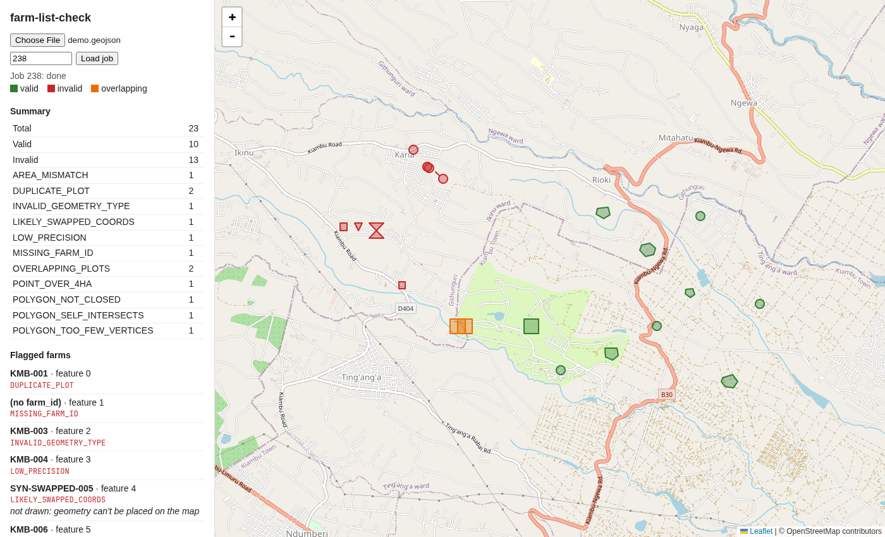

# farm-list-check

[](https://github.com/carrickkv2/farm-list-check/actions/workflows/test.yml)

Validates EUDR farm lists before they're submitted.

The EU Deforestation Regulation requires anyone placing coffee, cocoa and five other commodities on the EU market to supply the location of every farm plot the product came from, as GeoJSON. Real farm lists are messy: coordinates get swapped, precision gets lost in spreadsheets, and plots get entered twice or drawn overlapping. `farm-list-check` flags those problems per plot, with a reason code a support team can act on, and shows them on a map.



## Quickstart

```sh
docker compose up --build
```

Open http://localhost:8000 and upload `samples/demo.geojson`: 23 plots near Kiambu, Kenya. 10 are valid and 13 each have one mistake planted on purpose, one of every error type.

The same thing from the command line (Python 3.12, with the database from `docker compose up` running):

```sh
pip install -e ".[test]"
farm-list-check submit samples/demo.geojson     # prints a job id
farm-list-check run <job_id>
farm-list-check report <job_id> --format csv
```

Or over HTTP:

```sh
curl --data-binary @samples/demo.geojson localhost:8000/farm-lists   # → {"job_id": 1, "status": "queued"}
curl localhost:8000/jobs/1
curl localhost:8000/jobs/1/report
```

API docs are at http://localhost:8000/docs. Run the tests with `pytest`.

## Rules

Each plot gets zero or more reason codes. Rules that look at one plot run in Python; rules that measure area, check topology or compare plots run in PostGIS.

| Code | What it catches | Where |
|---|---|---|
| `MISSING_FARM_ID` | Plot has no `farm_id` | Python |
| `INVALID_GEOMETRY_TYPE` | Geometry isn't a Point or Polygon | Python |
| `LOW_PRECISION` | A coordinate has fewer than 6 decimal places, as written in the file | Python |
| `LIKELY_SWAPPED_COORDS` | Latitude is out of range but would be valid if swapped with longitude | Python |
| `POINT_OVER_4HA` | A plot declared over 4 ha is a single point; EUDR requires a polygon | Python |
| `POLYGON_NOT_CLOSED` | A ring's last point doesn't repeat its first | Python |
| `POLYGON_TOO_FEW_VERTICES` | A ring has fewer than 4 distinct corners | Python |
| `POLYGON_SELF_INTERSECTS` | The boundary crosses itself (`ST_IsValid`; the message includes `ST_IsValidReason`) | PostGIS |
| `AREA_MISMATCH` | Measured area differs from the declared `area_ha` by more than 20% | PostGIS |
| `DUPLICATE_PLOT` | Same shape as another plot in the list (`ST_Equals`) | PostGIS |
| `OVERLAPPING_PLOTS` | Overlaps another plot by more than 1% of the smaller one | PostGIS |

## How it works

```
upload ─→ job: queued ─→ validating ─→ done
   │                        │     └──→ failed ─→ retry (max 3 attempts)
   │                        ├─ Python rules, one small function each   (rules.py)
   │                        └─ PostGIS rules: validity, area, duplicates, overlaps (spatial.py)
   └─ same file again ─→ same job
```

The code reads top to bottom: `loader.py` → `rules.py` → `spatial.py` → `jobs.py` → `report.py`. `cli.py`, `api.py` and `static/index.html` are thin layers on top.

## Design decisions and trade-offs

- **PostGIS for anything geometric.** Topology checks, area on the earth's surface and polygon intersection are exactly what PostGIS is built for, and it's where this data would live in production anyway. Each list goes into a temporary table that disappears when the transaction ends.
- **`geography`, not `geometry`, for area and overlap.** Coordinates are in degrees. Casting to `geography` measures on the curved earth in square metres, so "4 hectares" means 4 hectares anywhere.
- **Precision is checked on the raw file text.** Once parsed, `36.821900` and `36.8219` are the same float. The loader keeps each number's original text so the rule sees what was actually written.
- **Jobs are deduplicated by file hash.** Uploading the same file twice returns the same job instead of repeating the work.
- **Reason codes per plot, not one error per file.** A supplier can fix every problem in one pass, and a support team can count and filter by code.
- **Crash recovery with a PostgreSQL session lock.** A worker holds an advisory lock while validating. If the process dies, PostgreSQL releases the lock, and the next caller marks the job failed so it can be retried. There's no timeout to tune, and a slow job is never mistaken for a dead one.
- **Results are saved all-or-nothing.** Every plot's result and the job's `done` status are written in one transaction.

## What I'd do next

- Replace FastAPI `BackgroundTasks` with a real queue and worker (e.g. SQS) for large lists.
- Add a spatial index for the duplicate and overlap checks. They currently compare every pair of plots (O(n²)), which is fine for hundreds of plots but not tens of thousands.
- Version the rule set, so results stay explainable when EU guidance changes.
- Add the next stage: intersect valid plots with a deforestation layer.

## Project layout

```
farm_list_check/
  loader.py       read the GeoJSON, keep each coordinate's raw text
  rules.py        per-plot rules
  spatial.py      PostGIS rules
  jobs.py         submit / run / retry / crash recovery
  report.py       JSON, CSV and map GeoJSON
  cli.py, api.py  thin interfaces over the above
  static/         the map page (Leaflet, no build step)
sql/001_init.sql
samples/          demo and valid farm lists (see samples/README.md)
tests/            one test file
```

The sample data is synthetic: fictional plots, not real producers.
